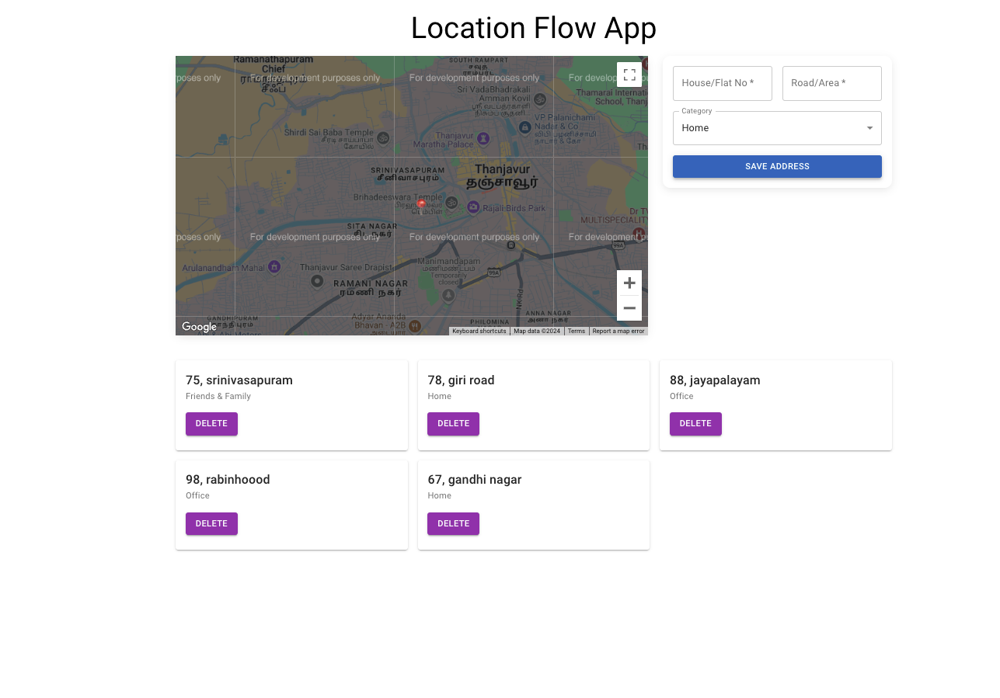

# Location Flow App

This is a web application that allows users to track and manage locations, displaying them on an interactive map. Users can either allow the app to access their location using the browser's **Geolocation API** or manually search for an address and mark it on the map.

## Features
- **Geolocation**: Users can enable location services to automatically get their current coordinates.
- **Manual Search**: Users can manually search for a location and place a marker on the map.
- **Google Maps Integration**: The app integrates with the **Google Maps API** to display an interactive map with a red pin showing the current location.
- **Save and Display Addresses**: Users can save addresses, which will be displayed in a list below the map.
- **Responsive Design**: The app is designed to be responsive, ensuring it works seamlessly on both desktop and mobile devices.

## Screenshot


## Requirements
- **Google Maps API Key**: You need a valid Google Maps API key to use the map functionality. [Get your API key here](https://cloud.google.com/maps-platform).

## Getting Started

### 1. Clone the Repository
First, clone the repository to your local machine:

```bash
git clone https://github.com/your-username/location-flow-app.git
cd location-flow-app
